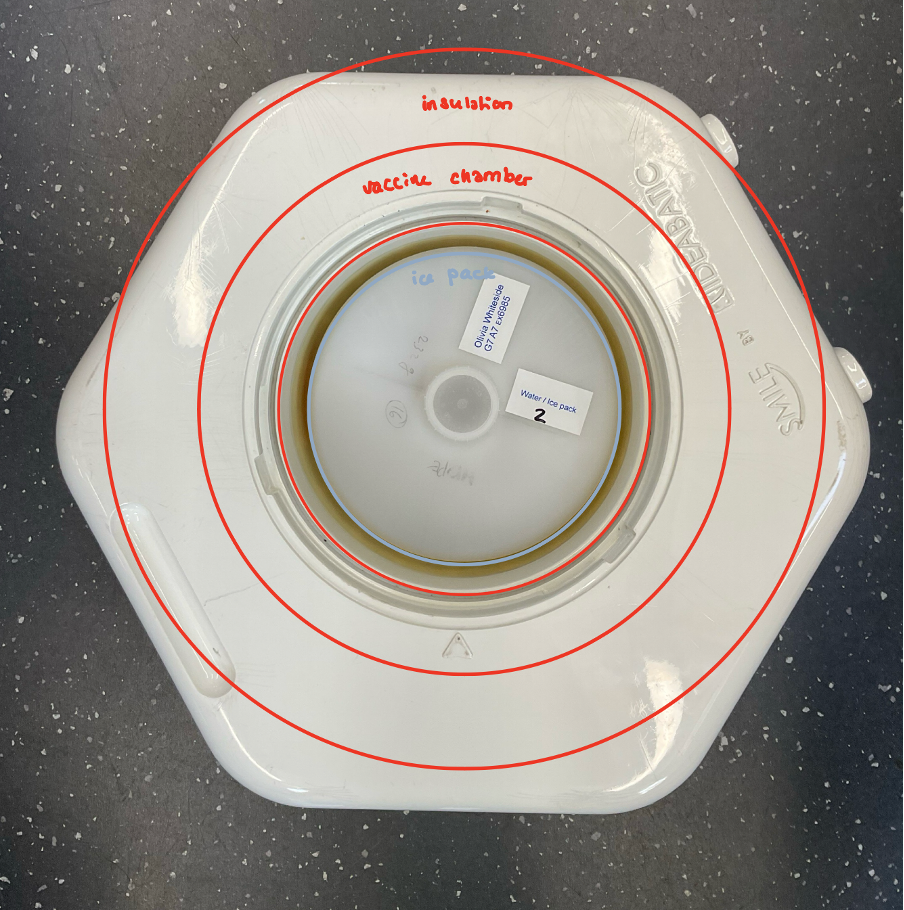
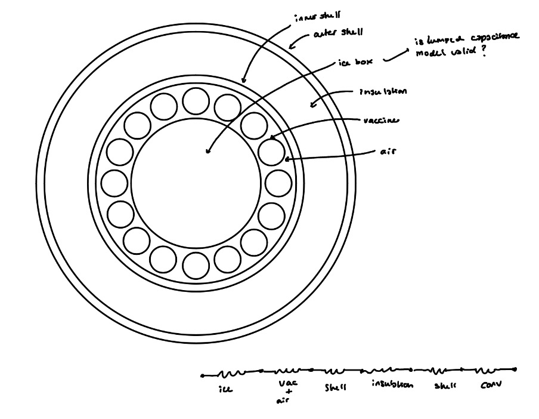
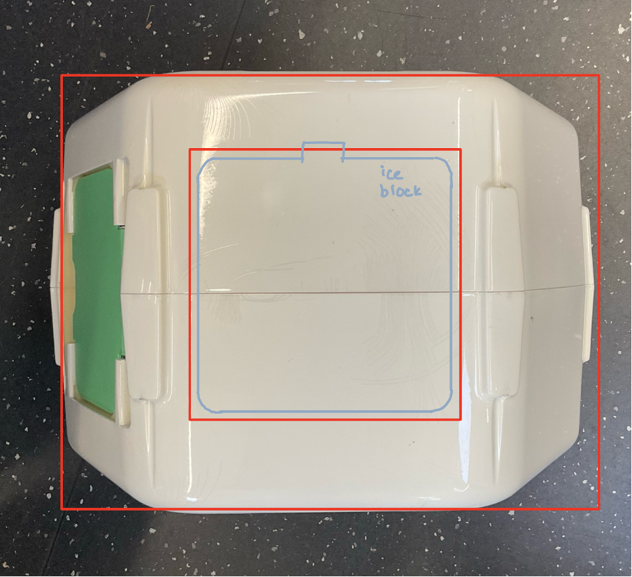
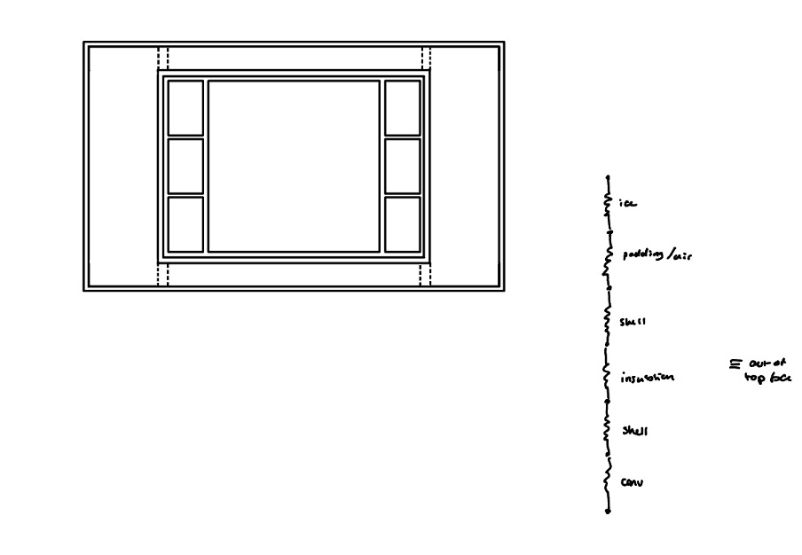
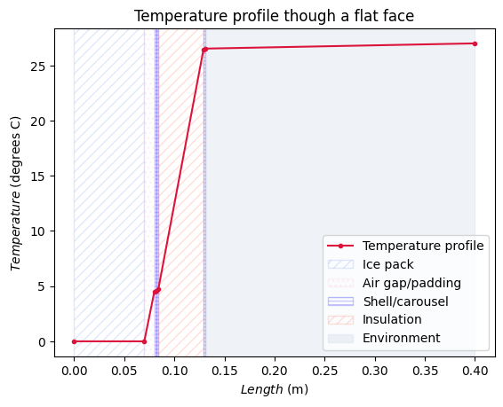
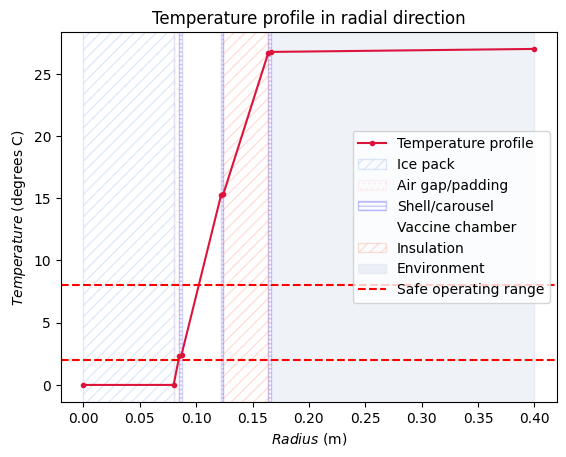
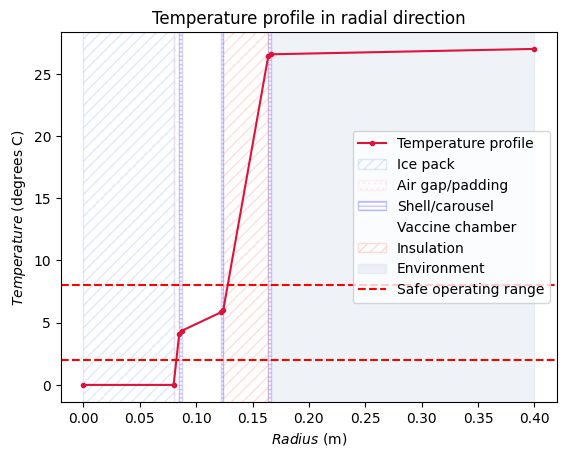
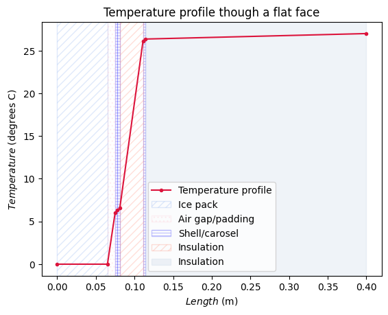
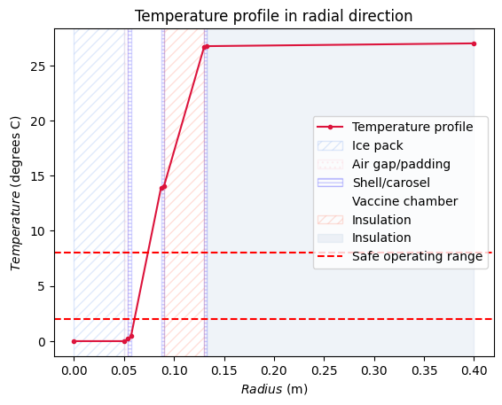

## Heat transfer analysis

### Objectives

To perform a basic thermal analysis with variable input parameters that can be changed to investigate the effect of insulation thickness, ice block size, insulation material and ambient temperature on the cool-time and temperature range of the vaccine chamber for example.

The aim was to have a tool that could help investigate how much the insulation thickness could be reduced, and also enable the testing of insulation and shell materials with different thermal properties.

### Assumptions made to build code

The cooler was approximated as two simple 2D shapes for the heat transfer analysis. 

The hexagonal face of the cooler was analysed as a circle with a diameter equal to the shortest width of the hexagon. This ensures the analysis will produce an underestimate for the time taken to warm up, so the true model will only outperform the prediction provided by this analysis. On the full sized smile, the isulation is 7cm thick in the side with the door and 4cm thick in the far side. An average thickness was taken for the analysis, however this could be improved in further analysis.

The figure shows the network of thermal resistances used around the hexagonal face, to calculate the heat transfer out of the 6 rectangular faces of the smile cooler. 
 

The following figure shows the resistor network of thermal resistances out of the flat hexagonal faces of the box, using a linear analysis.
 

As heat is gained through both the flat hexagonal faces, the box was assumed symmetrical and two identical resistor networks were used in parralel to approximate the heat transferred through these faces.

To calculate the total heat transferred from all faces of the box the radial and two linear resistance networks were all used as resistances in parallel, with the total temperatre difference across the box(from T_atm to T_ice). The total heat ransfer required to melt and warm the ice to a temperature causing the vaccine chamber to exceed the limiting temperature of 8 degrees C for storage. This quantifies the amount of heat tranfer required to reach the end of life of one use of the cool box (i.e. use of 1 ice block before requiring refreezing). Dividing this value by the total rate of heat transfer from all faces gives an esimate for the cool-time of the cool box. 

Further assumptions made include:
* The chamber cntaining the vaccines was assumed to have the thermal properties of air (the prescence of any vaccines was ignored).
  * Convective and conductive heat transfer were ananlyssed in paralell for the heat transfer in the still air of the vaccine chamber.
  * Assuming just conductive heat transfer gives a lower bound for the amout of heat transferred and an upper bound for the temperature in the vaccine chamber, whilst assuming convective heat transfer also, gives an upper bound for the annount of heat transferred from the cool box, and a lower bound for the temperature in the vaccine chamber and cool life.
* The thermal properties of the carosel were assumed to be the same as those of the ABS shell.
* The heat lost out of the hexagonal faces was assumed to happen over the area of the end of the iceblock and vaccine chamber

# Analysis of large box

### Inputs
T_atm = 27 degrees C  
T_ice_avg = -10 degrees C  
Ice bottle radius = 8cm  
Ice bottle height = 14cm  
Vaccine chamber radial dimension = 3.5cm  
Insulation thickness in radial direction = 4cm  
Insulation thickness along flat faces = 4.5cm  
Air gap above and below ice pack = 1cm  
Air gap around ice pack = 0.5cm

### Results
#### Upper bound for cool life - assuming just conduction in air gap

The temperature profile from the top or bottom of the ice pack, out through one of the two hexagonal faces is shown below:
 
 The rate of heat transferred from the two flat faces is, **Q_dot_l = 1.036 J/s**.

The temperature profile from the ice block to the rectangular walls, in a radial direction is shown below. Two limits for the vaccine storage temperature have been shown in the figure as dashed red lines. This region is significant in the vaccine storage chamber as the average temperature of the chamber(taken as average, instead of linear temperature gradient as shown, because of mixing effects of air) must lie within these limits for the vaccines to be preserved.
 
 The rate of heat transferred from the radial face is, **Q_dot_r = 1.542 J/s**.

The greater rate of heat loss from the radial faces shows that the heat loss out of the radial faces is the limiting factor for the cool life. 
By approximating the box as the radial and linear resistor systems in parallel the total heat transferred out of the cooler is,
**Q_dot = 2.579 J/s**.

This gives a cool life, with the vaccines below 8 degrees C, of **115.1 Hours**.
The large smile should last approx. 120 hours, so this shows that the software does give an underestimate as expected, but also a relatively close estimate of the cool life, suggesting it could be a useful tool for analysis of a smaller box design.

#### Lower bound for cool life- assuming conduction and convection in air gap

The temperature profile from the top or bottom of the ice pack, out through one of the two hexagonal faces is shown below:
 
 The rate of heat transferred from the two flat faces is, **Q_dot_l = 1.036 J/s**. This is unchanged by the inclusion if convective effects in the air gap.

The temperature profile from the ice block to the rectangular walls, in a radial direction is shown below, with convection effects now considered in the air gap as well as conduction. Two limits for the vaccine storage temperature have been shown in the figure as dashed red lines. This region is significant in the vaccine storage chamber as the average temperature of the chamber(taken as average, instead of linear temperature gradient as shown, because of mixing effects of air) must lie within these limits for the vaccines to be preserved.
 
 The rate of heat transferred from the radial face is, **Q_dot_r = 2.772 J/s**.

The greater rate of heat loss from the radial faces shows that the heat loss out of the radial faces is still the limiting factor for the cool life. 
By approximating the box as the radial and linear resistor systems in parallel the total heat transferred out of the cooler is,
**Q_dot = 3.808 J/s**.

This gives a cool life, with the vaccines below 8 degrees C, of **77.9 Hours**.
This is a much lower estimate for the expected cool life of the smile coolbox, but gives a range in which the true value would be exxpected to lie.
The large smile should last approx. 120 hours, so this shows that the software does give an underestimate as expected, but also a relatively close estimate of the cool life, suggesting it could be a useful tool for analysis of a smaller box design.

# Analysis of small box

#### Inputs
T_atm = 27 degrees C  
Ice bottle radius = 5cm  
Ice bottle height = 13cm  
Vaccine chamber radial dimension = 3cm  
Insulation thickness in radial direction = 4cm  
Insulation thickness along flat faces = 3cm  
Air gap above and below ice pack = 1cm  

 The rate of heat transferred from the two flat faces is, Q_tot_l = 0.713 J/s

 The rate of heat transferred from the radial face is, Q_dot_r = 1.129 J/s

This shows the face limiting the cool life is the radial face as before.
By approximating the box as the radial and linear resistor systems in parallel the total heat transferred out of the cooler is,
Q_dot: 1.841 J/s

This gives a cool life, with the vaccines below 8 degrees C, of **58.5 hours**.

## Effect of spacing between bottle and carousel - significant due to shrinkage when it melts

Considering worst case scenario for the heating of the vaccines: we assume full contraction in a radial direction and no contraction in the londitudinal direction.
On freezing the bottle with expand from 1 litre to 1.087 litres which results in a 4% radius increase. This space has been accounted for by a 1cm gap around the unexpanded bottle as it is likely the expansion will not be the same across the height of the bottle, so allows for more expansion at midsection.

The thermal properties of the materials in this gap are found to have a large impact on the temperature of the vaccine chamber.

When the gap is filled with air:
 
 Q_dot_r: 1.041805845369173 J/s

This gives a cool life, with the vaccines below 8 degrees C, of **61.3 hours**.

## Using predictions from Dan's scaling analysis

When the insulation of the small smile is set as 2.6cm the results are as follows:
 
 Q_tot_l: 0.7890635803234574 J/s

 Q_dot_r: 1.2706851966492552 J/s

This gives a cool life, with the vaccines below 8 degrees C, of **52.3 hours**.
MAin issuee with this design is keeping the vaccines within the safe operating range - could be affected by running analysis assuming convection in chamber however.

# Next steps

Produce analysis with convective heat transfer in vaccine chamber to produce an upper bound for heat transfer.

Investigate materials to support bottle in cavity - high thermal conductivity but also compressibility

Prototype bottle support mechanism with this in mind

Perform experiments to measure expansion of bottle when frozen, once the ordered bottle arrives.

