# Miniature SMILE Configuration Design
Article by Olivia Ambler

## Objectives

To consider several layout options for the design of the miniaturised smile and select a design to take forward to the prototyping stage.

### Desired functions

The design **MUST** perform the following funtions:
* Keep vaccines cool for up to 24 hours
* Keep vacines within the range from 2 - 8 degrees C
* Hold vaccines in fixed arrangement all equidistant from the centralised ice pack
* Have vaccines easily accessible for administering of vaccines
* Hold ice bottle in the centre of the ice bottle chamber (inner carousel)
* Provide easy access to ice pack for removal and freezing before each use

The design **COULD** perform the following functions:
* Have removable carosel parts for improved ease of cleaning compared with origional smile
* Have a symmetrical shell design so it can be made form to two identical ABS parts as in larger smile, reducing manufacturing costs
* Have self closing door
* Have compartmentalised design for easy location and labelling of each vaccine

## Analysis of current design

In the current large smile design, the carousel is fixed and cannot be removed only rotated, when the box is fully assembled as it would be in use. The sketch below shows the key components involved in holding the carousel inside the smile and allowing it to rotate. 
 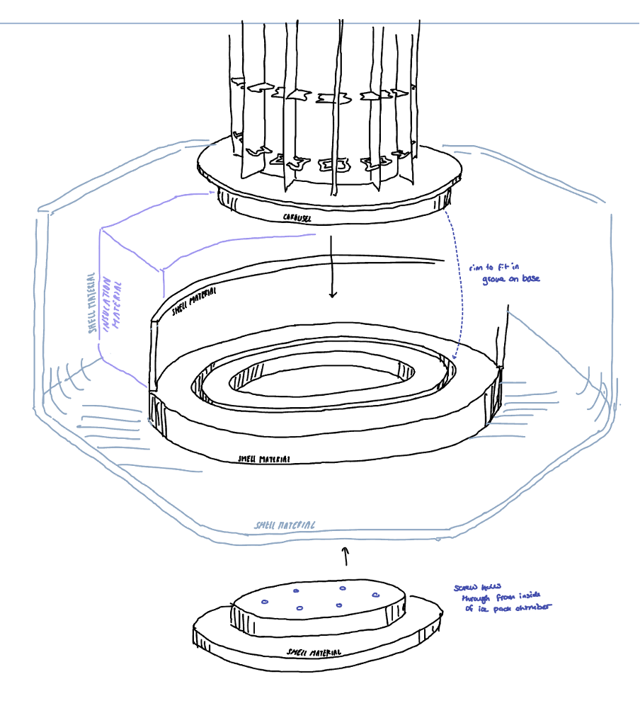
  The design consits of two identical outer ABS shell halves which could be sheet fomed using the same mould. The isulation is CNCd and fit inside each half, and an internal shell is fit inside the inslation. The two halves are screwed together once the carousel is in place. Because the insulation material is fragile and is directly exposed to the environment when the halves are separated, the carousel cannot easily be removed in service for cleaning.

Images of the large smile carousel, base inside one of the shell halves (including insulation and inner shell, and with bottom lid fitted), and bottom lid that gets fixed to base of carousel are included below:
 
 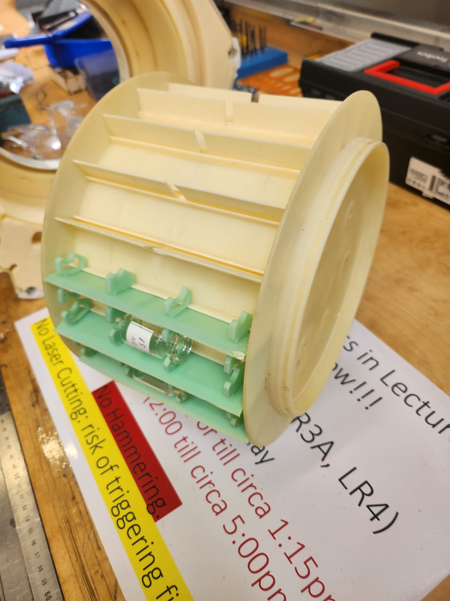
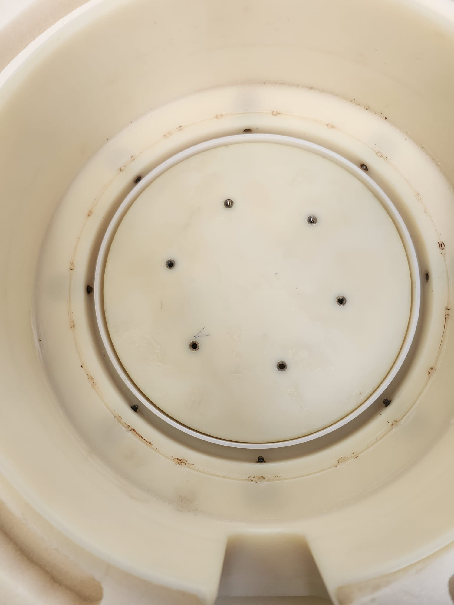
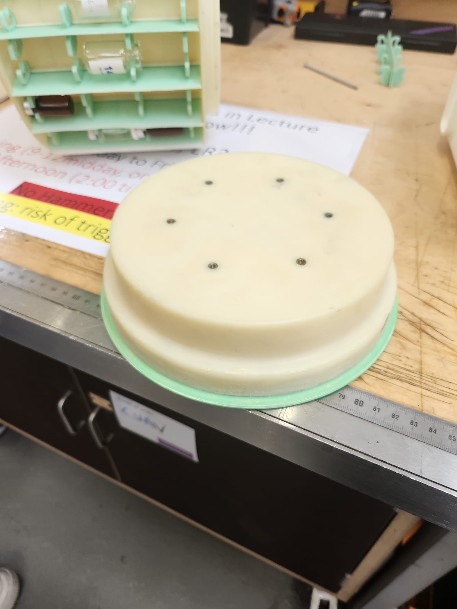
 As the two halves of the smile box are identical, both hexagonal faces have a hole for a 'plug' or circular door at the centre. One of these doors is shown in the images above, and is fitted to the carousel with 6 screws when the door is placed outside the box and the carousel inside, to hold it in place. This door can be rotated to directly rotate the whole carousel within the shell and change the vaccine chamber that is accessible through the side door. It is labelled with an inicator of which chamber is aligned with the door, and numbered for easy vaccine logging. 
 
 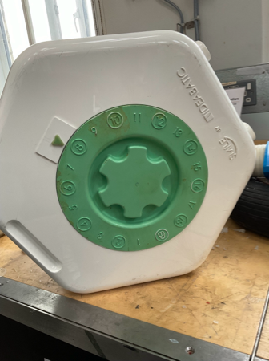

 A concentric recess is added in the inner shell with an equivalently placed lip on the bottom of the carousel to help centre it and locate the screws in the bottom lid. The lid on the other hexagonal face is removable with a simple locking mehcanism pictured below:
 
 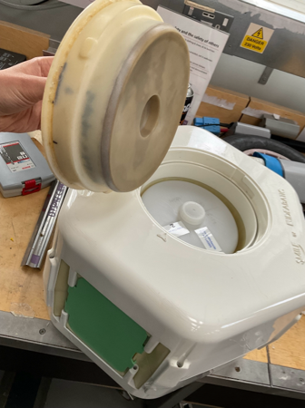
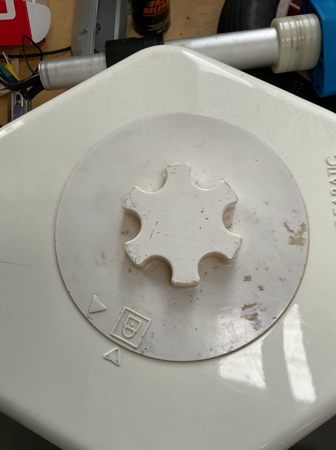

 This lid is removed to access and remove the ice pack bottle. Its diameter allows access to the inner carousel, keeping the outer carousel (vaccine carrying section) isolated from the environment.

The vaccines are accessed through a sprung self-closing door on one of the rectangular faces of the box. this allows acess to a single column of vaccines at once, keeping the others isolated from the environment. This design reduces the risk of healther leaving the cool box door open and warming all the vaccines whilst administering medications. The door is pictured below:
 
 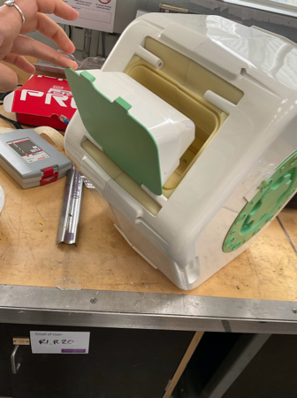

 Because of the prescence of the door on one of the rectangular walls, the insulation is not constamnt thickness radially around the ice pack, but is thicker at the side with the door to make up for thermal losses along the edges of the door, where there is no insulation.

Within the carousel inner chamber that holds the bottle ice pack, there is a small pin used to locate a bearing that fits a recess in the base of the bespoke ice pack bottle and helps to keep it central despite its expanding and shrinkage due to the state of melting. There is a similar recess in the removable lid to the chamber which helps to centralise the cap of the bottle. This lid is also made with a rubber, compressible contact to the bottle, to allow space for expansion and skrinkage.

## Potential configuration options for miniature SMILE

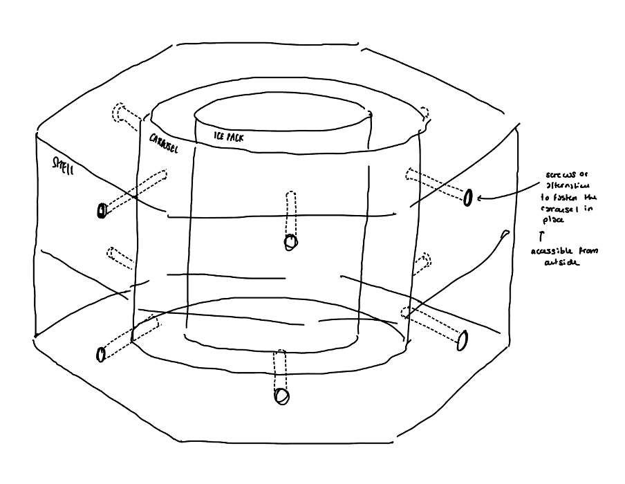

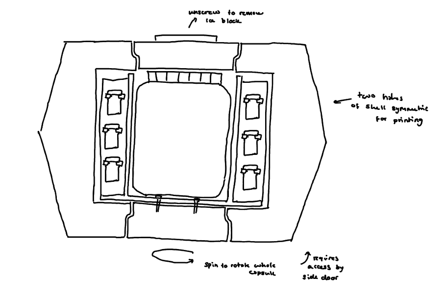
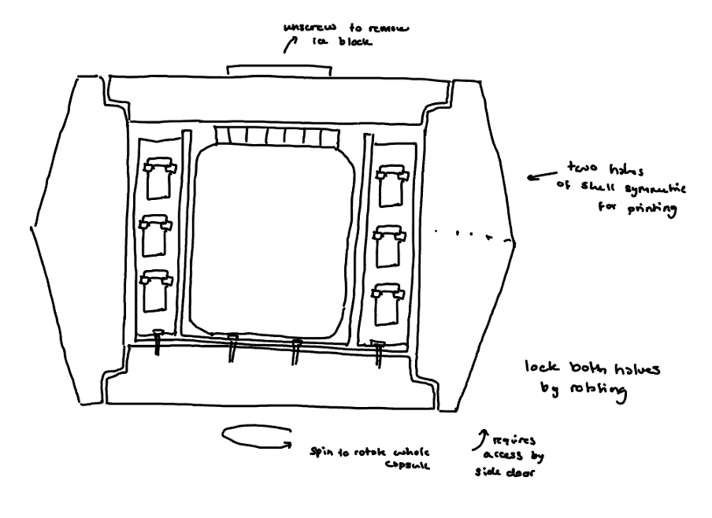

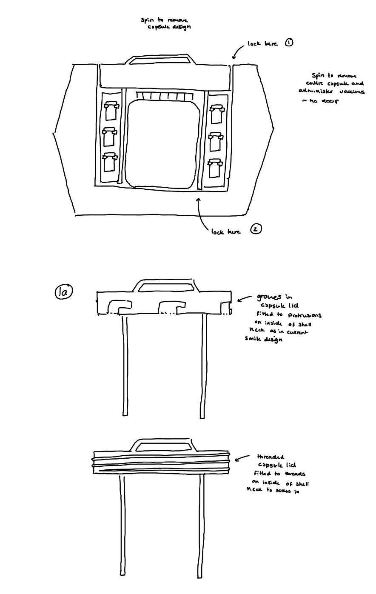
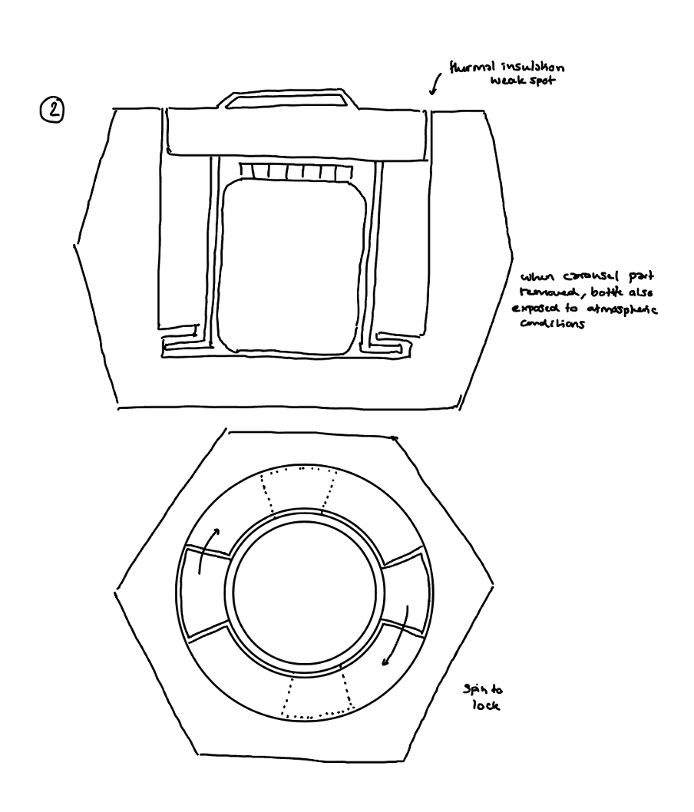
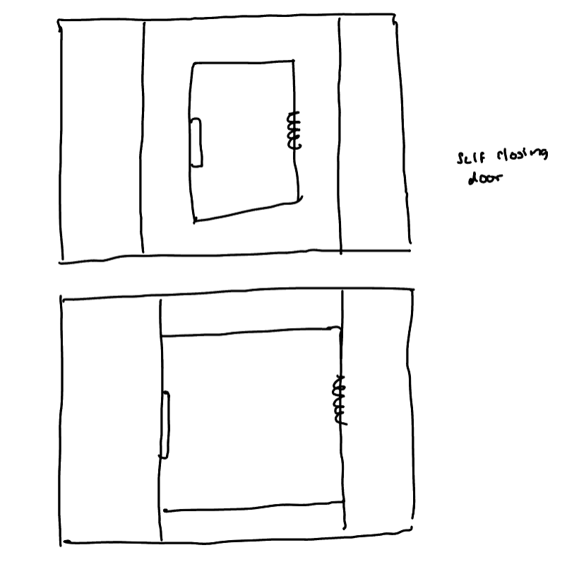

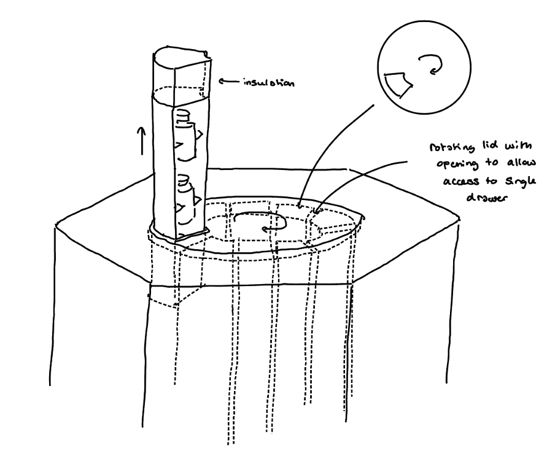
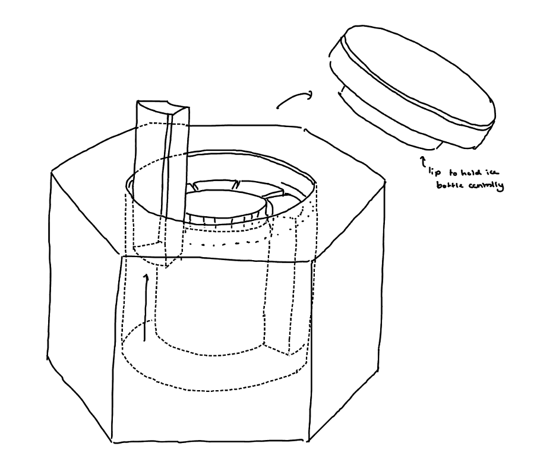
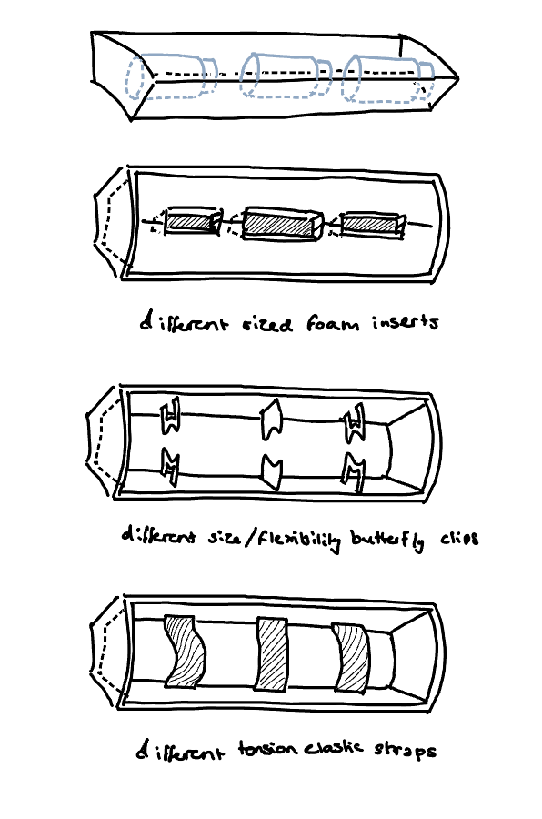
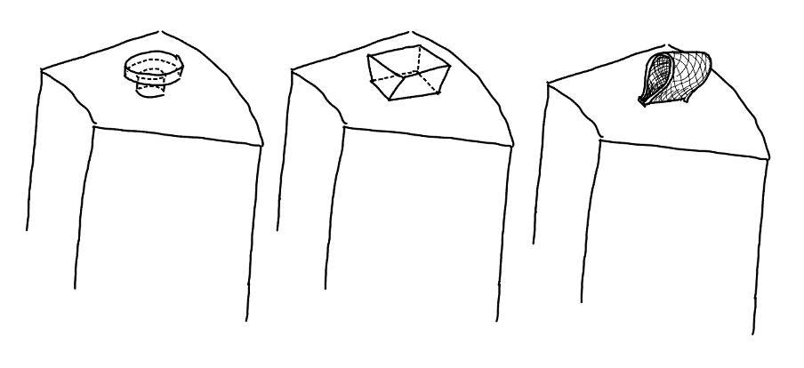

## Centralising ice bottle in chamber

## Final dimensions and analysis
