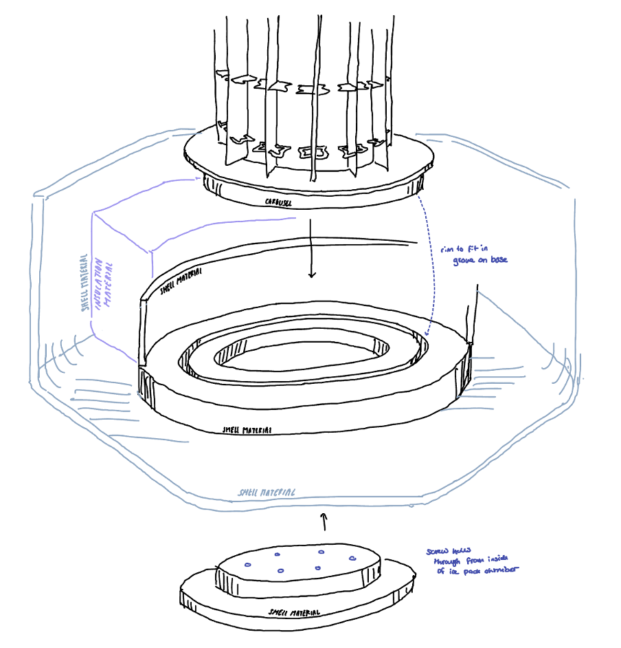

# Miniature SMILE Configuration Design
By Olivia Ambler

## Objectives

To consider several layout options for the design of the miniaturised smile and select a design to take forward to the prototyping stage.

### Desired functions

The design **MUST** perform the following funtions:
* Keep vaccines cool for up to 24 hours
* Keep vacines within the range from 2 - 8 degrees C
* Hold vaccines in fixed arrangement all equidistant from the centralised ice pack
* Have vaccines easily accessible for administering of vaccines
* Hold ice bottle in the centre of the ice bottle chamber (inner carousel)
* Provide easy access to ice pack for removal and freezing before each use

The design **COULD** perform the following functions:
* Have removable carosel parts for improved ease of cleaning compared with origional smile
* Have a symmetrical shell design so it can be made form to two identical ABS parts as in larger smile, reducing manufacturing costs
* Have self closing door
* Have compartmentalised design for easy location and labelling of each vaccine

## Analysis of current design

In the current large smile design, the carousel is fixed and cannot be removed, only rotated, when the box is fully assembled as it would be in use.
 
 

## Potential configuration options for miniature SMILE

## Centralising ice bottle in chamber

