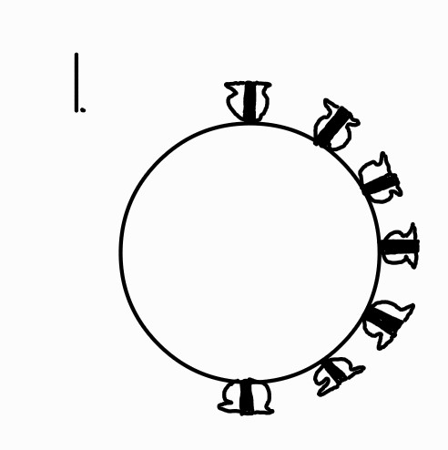
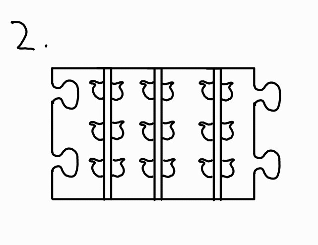
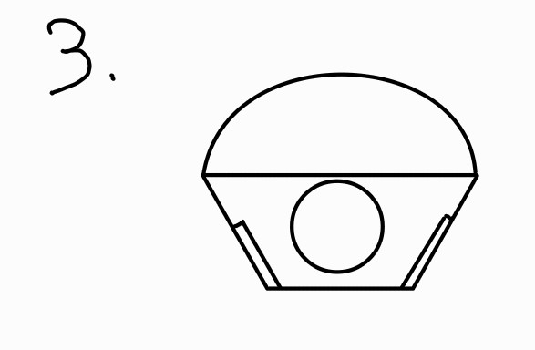
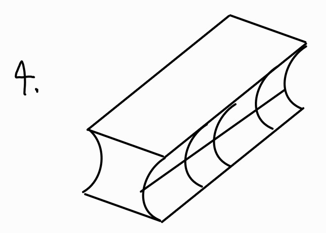
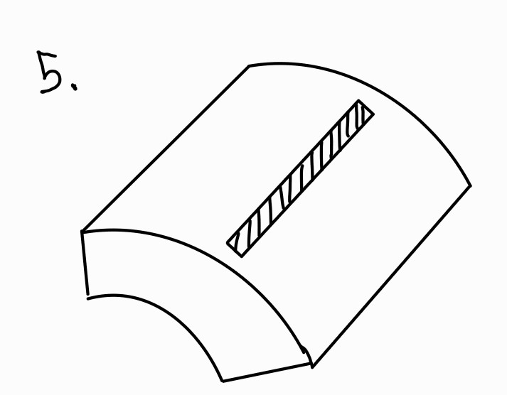
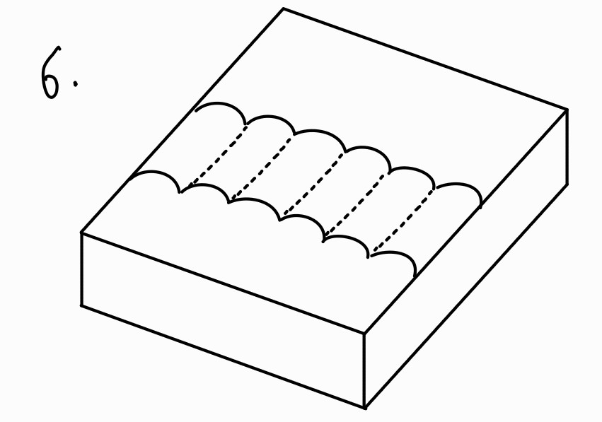

# Rapid prototyping of the carousel 
Article by Caio

The prototyping began by creating a table which listed the necessary functions and features of the carousel. This let us get down to the basics, and gave us a lot of areas to work from. These jumping off points let us quicklly change and iterate upon our ideas, while having a well defined baslien to fall back to to ensure t eh changes were so drastic they no longer served theor original purpose.

## Importance table
| Part | Reason | Improvement | constraints | Adresses what need | Importance |
| --- | --- | --- | --- | --- | --- |
| Attachment mechanism of vaccine to carousel | Needs to hold vaccines |  Could try looking at different materials, doesnt need to be slotted in the same way, could be an elatic band, or some foam to hold it in place | Needs to have enough friction to hold in place without falling, does not need to be as soft as before, since journey is less rough. |  Adresses the form factor, as more efficient use of the space would allow for a smaller pack. Also can address teh modularity and compatibility with the original smile   | High |
|  | |  | |  |  |
| No. Vaccines | Needs to be maximised since the other constraints are already being met for cold time. Can always underfill, so need to think of a cheap and versatile way to store more. At least a certain number must be met, or too many will need to be brought and the pack will be at capacity | Could be as simple as making the carousel smaller to fit the 1L box.   Could look at improving attachment mechanisms to add more vaccines? Or make it more versatile.   Maybe a sock/strap type thing like in a toolbox to make it really thin and versatile | Maximise  Each vaccine could take 20-30mins. Over one full day (12 hours?) would need at least 24 | Probably fewer vaccines than SMILE, but will make it more portable and easier to transport while still having the maximum utility  Current SMILE has a very large ice pack, and not all slots are always filled (currently 3 vaccines per section \*18 sections).   Smaller journeys will need less vaccines as they would probably be limited by the number of patients in one day | High |
|  | |  | |  |  |
| Simplicity | Easily repairable means if something goes wrong, it can be fixed quickly and wont waste the entire pack. increases teh usable life and effectiveness of the smile |   Core benefit of current SMILE is the lack of human error possible, but these can be solved for shorter journeys as the human error would be less critical  |  Must keep single ice pack, and must try and keep some form of automatic door closer   |  Human error can cause vaccines to be rendered completely ineffective a lot quicker, and so need to try best to prevent this from happening. Not the end of the world as a chcecklist can serve a lot of the same functions    | medium-low     |
|  | |  | |  |  |
| Modularity | Able to be used on the big box |   reduce the number of components? Could join multiple of the  green rows together to allow for fewer parts to be needed. Can also look at carrying syringes and needles inside the carousel, as that would make the storage far more efficient for trips where not that many vaccines are needed |    Must be easily cleanable or cheaply replacable as it is still a medical instrument, and cannot have chemicals leeching into vaccines etc. |   Compatible with the original design of the holders, would neeed a whole new injection mould but could potentially be repurposed for both if a large redesign is to be had.  |   Medium  |
|  | |  | |  |  |
| Weight | Needs to be transportable so cool box can reach difficult-to-reach locations, though less rough terrain so can give up SOME rigidity | Reduce dimensions since weight only goes down by the cube.  Thin insulation, although insulation is mostly air so limited effectiveness | Under 10kg | Transportable, probably less durable, but enough to withstand standard use | High |
|  | |  | |  |  |

## Discussion of possible sketches
 

 

### 1. 

Simply making the carousel smaller. It works well as the design is already there, and would be easy to assemble and repair, but  form experience it is very easy to pull off by accident, and takes a few minutes to get right

 

### 2.

Idea to make it one long slab, which can be modular for any size of smile. Puzzle attachment is probably nto the most secure, but allows complete modularity without much change in the design. Need to run heat analysis on it

 

### 3.

Having a capsule for needles etc is something to be explored. Can fit in the same gap as the current butterfly attachment. Big issue since currently the bag is used to carry the extra bits, but is just too big.

 

### 4.

Using foam inserts. Is a lot simpler, acts as insulation, and is incredibly easily repaired. Will break a lot quicker, which may be ok if the hospital is well off.

 

### 5.

Same benefits and issues as before, but is more versatile so can stuff anything within the small crevices. 

 

### 6.

Straps sewn onto foam (have seen before) Can work quite well. If careful with it will last a long time, and can be easily taped up without losing protection. would be very cheap to produce, incredibly modular, much more versatile, and a much flatter profile. Startup cost much lower but might end up being more expensive per part
