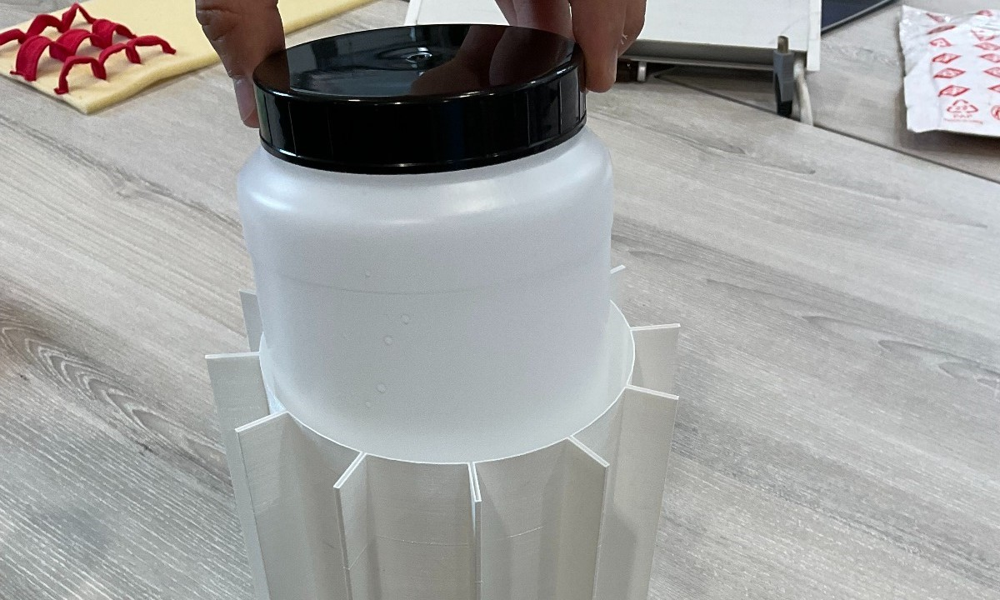

---
title: SMIRK - Miniaturising A Vaccine Cool Box
---

# Project to miniaturise Smile by Ideabatic

## Introduction to project
The SMile project is a project created by the start-up company Ideabatic. Their aim was to make a smaller and more simplified version of their current well received SMILE, which we were tasked to design and prototype to develop a solution for the smaller version. An emphasis was put on the modularity and repairability of the design, with a focus on ensuring the pack could be used for up to 24 hours. The current Smile is large and bulky, and has a 5 day cold time, which is in excess of that required for shorter 'last mile' journeys to places closer to hospitals. The original Smile also has a non-standard, bespoke ice pack which is expensive to manufacture, whereas the smaller Smile has been designed around an alternative off-the-shelf 1L water bottle. Different ways of transporting the Miniature Smile were also explored, as the current Smile Backpack is bulky and expensive to manufacture.

## Aims of the project
Every day, thousands of vaccines are destroyed and rendered useless due to heat. The SMILE vaccine carrier aims to solve this by emphasising ease of use, limiting scope for human error, and improving comfort during carrying and transportation. The smile is used in long journeys which require many hours of walking to get to small villages without the easy access to modern medicine or vehicles. While the current box is fantastic for this use case, having such a large box that can last 5 days is not always suitable, where the majority of a journey will be done in a car before the walk. This is why we are aiming to bring all these features to a smaller, cheaper, and simpler version. The current [cold boxes](market_research.md) do not have significant presence ioptimised for markets like this, persenting an opportunity for the smaller Smile to help with transporting vaccines at a similar price point to the available market options, but with improved performance for the specific use case. The smile also has an advantage in being specifically designed for carrying over distances longer than a few hours, and not a short drive down the road from a GP office, since current carriers are, at best, inefficient cool boxes. 

## Sustainable development goals
The project aim aligns with the following sustainable development goals: 
<br>
<br>
The mini smile provides most progress towards target 3.8: "Achieve universal health coverage, including financial risk protection, access to quality essential health-care services and access to safe, effective, quality and affordable essential medicines and vaccines for all". The development of this ergonomic and efficient vaccine carrying cool box for shorter 'last mile' journeys in low income countries such as Cameroon has close alignment to the 3rd sustainable development goal, as its overarching aim is to improve access to vaccines in places where this is currently difficult and vaccines often get spoilt on such journeys. 

<p style="clear: both;">
<br>

The development of a miniaturised SMILE is helping to "promote sustained, inclusive and sustainable economic growth, full and productive employment and decent work for all" by enabling the equal access to vaccines, which will have a knock on effect on peoples ability to work, and therefore an increase in growth for low income countries. Access to healthcare is an advantage of living in a high income country that should be made a possibility in low income countries also, to enable equal working and growth opportunities.

<p style="clear: both;">
<br>
The product is innovative as it fulfills a market need with an approach to the solution that is unlike other products in the same market. It demonstrates the use of innovation and technological development being used to help low income countries,reducing knowledge inequality by sharing solutions and technologies developed in a high income country. 

<p style="clear: both;">
<br>
<br>

Reducing inequalities within and amoung countries is a goal that aligns with the aims of the miniaturised smile. By enabling more efficient provision of vaccines to rural villages and areas requiring health workers to hike with their equipment, the disparity between more populated areas with access to healthcare services and those with no or very limited access is reduced. By equalising availability of such services, the workforce is given equal opportunities to maintain their health and therefore also their jobs. Sharing knowledge and solutions from high income countries also decreases the knowledge gap between countries.

<p style="clear: both;">
<br>

The miniaturised smile has been designed for modularity, repair and resiliance, supporting circular economy sustainable design principles. By designing the product to be easily maintained, cleaned and repaired, modular and robust reduced waste produced and extends the product lifetime. The aim of the product is also to reduce the number of spoiled vaccines by storing them within an optimum temperature range, preserving valuable rescources.

<p style="clear: both;">
<br>
<br>
</br>
</br>

## Features Section
Our final design blended the original design and parts, with innovative solution to issues which no longer existed with the new application. We aimed to keep large portions of the design similar, so as to keep the branding and thermal performance, while ensuring our solutions were feasible.

### Size reduction
We begun by performing a [thermal analysis](Daniel/Thermal_Analysis.md) and [mass analysis](Daniel/Mass_Analysis.md) to test the feasibility of such a Miniature Smile, and to get an initial estimate for its size and weight. From this analysis we concluded that the Miniature Smile would weigh about 2 kg and would need around 2.6 cm of insulation. When accounting for the reduced size of the ice pack used, this would bring the Miniature Smile's corner-to-corner diameter to around 30 cm. A [higher fidelity thermal analysis](temperature-analysis.md) was conducted using a [tailored heat transfer analysis software](mini_smile.ipynb) to test the proposed dimensions of the miniaturised smile.


### Ice Pack
<br>

The new and improved [ice pack](temperature-analysis.md) now costs 1/10th of the original, while still fitting in the same dimensions as before. The ice pack can last 8 hours without insulation, and much, much more once inside the SMIRK device. Given its reduction in size, it also only expands by 4mm each direction, letting us have much tighter tolerances, minimising the size of the carrier.

<p style="clear: both;">

### Size Reduction
<br>
With the new standard 1L ice pack, we managed to ensure the vaccines be kept at 2-8 degrees throughout the cross section for up to [24 hours](ice_chamber_code_slash_maths.md). The volume savings were up to 52%, reducing the overall weight drastically, making it incredibly portable for the smaller journeys, while still having enough space for up to 36 vaccines in one trip.

<p style="clear: both;">

### Carousel
<br>
The proposed inner carousel was designed to be both modular and easily repairable, while remaining easy to clean and versatile enough that it could carry a syringe and needles for each vaccine. The design has the entire carousel visible when the box is open, but allows only one set of vaccines to be exposed at any given time, keeping the cold air inside, extending the cold time. While the door no longer automatically closes, it lets us keep the same lid design for the large SMILE and the smaller SMIRK, allowing for modularity and ease of replacement for the components. This also allows for the extreme versatility in how the pack is used, as you are free to choose whether you want to maximise vaccines, or if it will be more convenient to also carry the syringes and needles in the same pack. This design was chosen through prototyping a [modular design](basic-modular-prototyping.md), then combining it with a [single section design](Layout_design.md) with the thermal code, before [3d printing](3d-final-prototype.md) the prototypes.
The inside of the carousel was also layered with some foam. This allows for the expansion of the bottle once the water has frozen, and continues to hold it securely once the bottle begins to melt and shrink. The foam can be easily replaced, and is physically separated from the vaccines, keeping them safe from contaminants. The foam also allows for protection of the bottle, and since the whole assembly no longer needs to rotate, the added friction won't affect the performance.


### Transportion
<br>
The backpack produced for the original Smile added some comfort while carrying, and allowed for important information to be written on the top, with added capacity for a biohazard box for the needles and syringes used. It was quite expensive and bulky though, and so we devised a different way to carry the Miniature Smile. An [initial strap-system](Daniel/Initial_Strap_Prototype.md) was devised and prototyped for the Miniature Smile whereby straps which were modular, removable and interchangeable were attached to the casing of the Miniature Smile using hook-like attachment points which could be glued on. These hook-like attachment points could be glued onto both the original and the Miniature Smile and straps could be interchanged between the two, making the design modular. These modular attachment points allowed the user to pick whichever strap was most comfortable and attach this to the box. After testing of this prototype, however, it was noticed that there was insufficient support around the user's lower back, causing pain during usage. To combat this problem [alternative methods of carrying the Miniature Smile](Daniel/Further_Strap_Research.md) were explored. The [final design](Daniel/Final_Strap_Prototype.md), shown to the left, was based on suitcase-to-backpack conversion systems whereby the Miniature Smile is mounted on a backpack unit using 3 straps which wrap around each of the box's 6 side faces. This proved to be more comfortable than the inital design, and is similar to the design that last year's group settled on.


## Road to miniaturising
Put links and documentation to initial ideas, and how the market research was further refined
### Redefined aims of project, and expand on what teh orignal breiif was, howe we looked into it, how it changes, and how we settled on a final project


# handout stuff
## Group report 

Web-page highlighting the general context of your work (i.e. the problem your
partner is trying to solve and how your work fits into this) and the technical summary
of what you did and/or achieved. This should be aimed at the general public.
Illustrations and other media supporting ~500 words of text would be appropriate.
Keep it concise and engaging.

• Reflective discussion about the work’s alignment with the Sustainable Development
Goals and where applicable with the UNICEF principles for Digital Development. ~500
words, attached to the web page.

[Statement about project management](Daniel/Project_Management_Statement.md):
We begun the project by identifying the strengths and weaknesses of the members of our group. We found that we all had similar interests in mechanical engineering and design, as well as similar skillsets, having mainly taken overlapping modules. This led us to work collaboratively at the start of the project, working as a group to identify a project proposal and work that needed to be done to reach that endpoint. On reflection, this style of working was good to have at the beginning of the project as it ensured that we were on the same page with regards to the direction we wanted the project to go in. In future, perhaps working as closely as we did was not necessary and maybe we would have been more productive if we had allocated some of this work to complete individually. Overall, however, I think that the strategy we employed worked well.

As we became more deeply involved with the project the amount of work that was allocated to be completed individually increased. This was because we thought that by focussing our concentration on specific aspects of the project we would increase our productivity and make more progress on the project. At this stage the scope of the project was very well defined, having worked collaboratively for the first part of the project, and as such we were able to complete this individual work without any misunderstandings in what we were each expected to do. At this stage of the project Daniel was tasked with performing a high-level thermal analysis, a high-level mass analysis, and creating a prototype of the Miniature Smile along with a pair of prototype straps so that the Miniature Smile could be mounted on the user's back for transportation. Olivia was tasked with completing an in-depth thermal analysis of both the original Smile and the Miniature Smile using the design parameters extracted from Daniel's high-level thermal analysis. Caio completed some more market research to further pinpoint the market we were targeting, and also started worked on making a modular carousel which could be used in both the original and Miniature Smile. What went well was that we were each able to make good progress in the areas we had been assigned, however the individual nature of the work we had performed at this stage became clear at the Interim Presentation when we struggled to tie together the work we had done. Perhaps it would have been better if we'd scheduled more frequent catch-up meetings to discuss how all of our work tied together so that we had a more coherent project for the Interim Presentation.

For the final part of the project we tried to find a happy medium between the two styles of working we had previously tried. We each completed our own individual pieces of work, however we communicated with each other much more as we went about this, so that the problems with coherency in the Interim Presentation were avoided. For this part of the project Daniel was tasked with performing research on pre-existing straps which could be modified to mount the Miniature Smile as suggested by Lara, Olivia was tasked with redesigning the bottle chamber to make it more modular to aid cleaning and maintenance, and Caio was tasked with prototyping modular carousel designs. Overall we believe that we worked effectively and harmoniously as a team, and we all developed our collaboration and communication skills throughout this project.


## Individual report – Wiki format. You may use markdown files on the git repository, and the
GitHub wiki feature on your repository.
Each student will take ownership of a part of the technical output, giving credits to others
where appropriate. It would be helpful if the author of each each section is clearly indicated
on the mardown file, although the commit history would also reflect this in principle. There
are 15 marks available for this section (individual). The content should cover:
• The technical presentation of the solution and its effectiveness to address the
problem, presented as handover notes for the partner.
• Description of the data/code/blueprints available in the repository, with links to the
content as required.
In addition to the technical quality of the work, the following criteria will be part of the
assessment:
• Is the document clear and complete enough for someone else to use the work?
• Could somebody else continue the work based on the information available? (code
well documented, building instructions, briefing notes about strength and
weaknesses of the project, material well structured, etc.)


### To configure your website:

- The required files to run a basic website are included in the repository. We use here Jekyll to turn markdown files into html that will be automatically updated on the website. The component responsible for this is a GitHub action, which is specified in the folder .github/workflows. There is no need to change this file. However:

- In the settings of your repository, go the section "Pages", and select GitHub Actions in the drop down menu to indicate that this is the way you'd like the webpage to be generated.

- Each time you update the markdown files in the www folder of the repository, it will regenerate the web content. The address of the website will be:

```
https://technology-for-the-poorest-billion.github.io/[your repo name here]
```

- index.md is the root of your website. To link another page from here, located within the www folder, use the following syntax:

```
This is a [link](linkedpage.md) to interesting content.
```

Which results in:

This is a [link](linkedpage.md) to interesting content.

- Pay attention to the header of the markdown files in this section. It contains a title section that you will need to reproduce for each page to render them properly.


